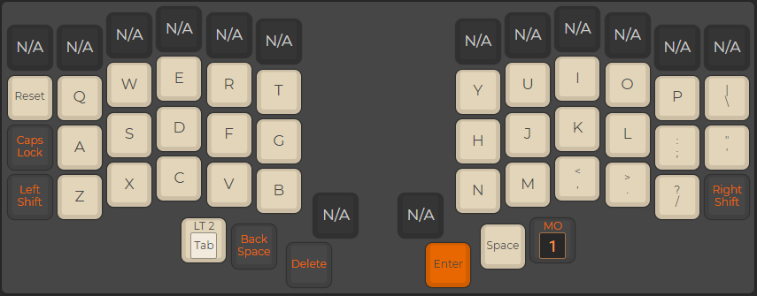
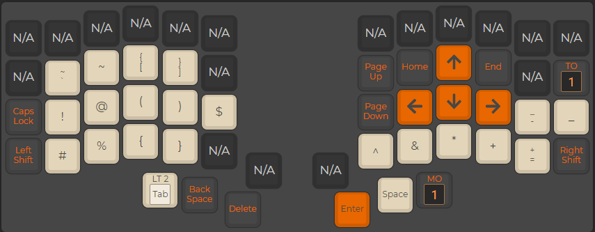
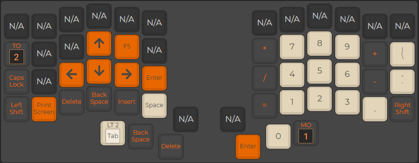
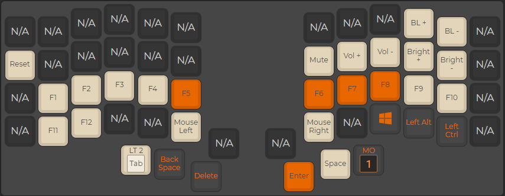

# Thumbtastic keymap that I use for my Iris and Dactyl
Just the right amount of work get's done with the thumbs.
Images are from an Iris, but the layout is the same since I do not use any key not listed.
### Default Layer

### Right (1) Layer

### Left (2) Layer

### Dual (3) Layer

### Build command
`pushd ~/git/qmk_firmware ; make handwired/dactyl_single_mcu:thumbtastic CTPC=yes ; popd`
